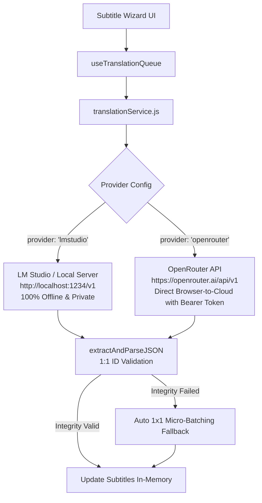

# Subtitle Wizard 🪄

> **100% In-Memory, Client-Side Subtitle Processing, Interactive Editor, Spotify Lyrics Studio, AI Translation & Universal Media Subtitle Extractor**
> 
> *Optimized for AI Agents, Pair-Programming Assistants & Human Developers.*

---

## 🌟 Project Overview

**Subtitle Wizard** is a modern, privacy-first web application designed to parse, extract, validate, edit, timing-shift, synchronize, translate, and export `.srt`, `.vtt`, and `.ass` subtitle files entirely in client memory. All processing occurs locally within the browser, requiring **zero backend servers**, **zero intermediate proxies**, and guaranteeing complete user privacy.

### Key Mission & Objectives
- **Zero-Cloud & 100% In-Browser Execution**: All subtitle parsing, editing, waveform sync, container inspection, and state management run in client memory without external server persistence.
- **Universal Media Subtitle Extractor & Demuxer**: Inspects video/audio containers (`.mkv`, `.webm`, `.mp4`, `.mov`, `.m4v`) in browser memory via binary EBML / ISO Box parsing, identifies all embedded subtitle tracks, and converts selected tracks directly into editable `.srt` format.
- **Dual LLM Provider Architecture (LM Studio & OpenRouter)**:
  - **LM Studio (Local / Private)**: 100% offline inference on your own hardware via local endpoints (`http://localhost:1234/v1`).
  - **OpenRouter (Cloud API / BYOK)**: Access DeepSeek V3/R1, Claude 3.5 Sonnet, Gemini 2.0 Flash, Llama 3.3 70B, GPT-4o Mini and more using your own OpenRouter API key stored safely in browser `localStorage`.
- **Unified Workspace & Always-On Studio**: An elegant, continuous interface where the Media Stage (Video or Dark Canvas Preview) and the Spotify Lyrics/Live Editor coexist side-by-side.
- **AI Batch Translation Engine with 1:1 ID Guarantee**: Slices subtitle cues into configurable batches, enforces strict JSON structured output, preserves multi-speaker dialogues (`- Speaker 1\n- Speaker 2`), validates 1:1 cue ID integrity, and automatically degrades to 1x1 micro-batching to prevent off-by-one errors.
- **Interactive In-Memory Subtitle Editor**: In-place text and timestamp editing, cue insertion, cue splitting, adjacent merging, and non-destructive Undo support.
- **Precision Timing Shift Tools**: Millisecond-accurate global, progressive, or selective time shifts with automatic zero clamping.
- **Temporal Integrity Diagnostics**: Instant detection and visual flagging of cue overlaps, invalid durations (<100ms), and empty subtitle blocks.
- **Spotify Lyrics-Style Interactive Panel**: Real-time flowing subtitles on the right of the video featuring smooth auto-scroll to the active line, dimmed inactive cues, and in-place editing that automatically pauses media playback.
- **Multi-Format Export Suite**: Export to canonical SubRip (`.srt`), WebVTT (`.vtt`), Advanced SubStation Alpha (`.ass`), and Plain Text (`.txt`) with Single (Translated/Source) or Bilingual Dual modes.
- **Modular i18n**: Fully decoupled JSON internationalization system (Spanish / English) without external packages.
- **Session Auto-Persistence & Memory Wipe**: Automatic local restoration of workspace state between browser reloads, with a 1-click "Borrar Todo" memory cleaner.

---

## 🛠️ Tech Stack

| Layer | Technology | Description |
| :--- | :--- | :--- |
| **UI Framework** | React 19 (`^19.2.8`) | Modern component architecture, functional hooks |
| **Build Tool & Bundler** | Vite 8 (`^8.2.2`) | Ultra-fast HMR and production bundle optimization |
| **Styling Engine** | Tailwind CSS v4 (`^4.3.3`) + `@tailwindcss/vite` | Modern `@import "tailwindcss";` without legacy configs |
| **Iconography** | Lucide React (`^1.35.0`) | Clean, accessible SVG icons |
| **Class Utilities** | `clsx` + `tailwind-merge` | Conditional and merged utility styling |
| **Universal Media Extractor** | Pure ES Modules (`src/services/mediaExtractorService.js`) | In-browser EBML & MP4 atom demuxer for embedded subtitles |
| **Parser & Serializer** | Pure ES Modules (`src/utils/srtParser.js`) | Zero-dependency millisecond-accurate SRT parser |
| **Timing & Integrity Engine** | Pure ES Modules (`src/utils/timingUtils.js`) | Time shifting, overlap validator, split, merge & insert |
| **Multi-Format Exporters** | Pure ES Modules (`src/utils/exporters.js`) | SRT, WebVTT, ASS/SSA, Plain text & Bilingual dual |
| **Dual LLM Client** | Native `fetch` + `AbortController` (`src/services/llmService.js`) | Dual provider client supporting LM Studio and OpenRouter BYOK |
| **Batch Translation Engine** | Custom Orchestrator (`src/hooks/useTranslationQueue.js` & `translationService.js`) | 1:1 ID validator, multi-speaker dialogue prompt, and 1x1 micro-batch fallback |
| **Local Media Player** | HTML5 Media API (`src/components/MediaSyncPlayer.jsx`) | Memory-safe `URL.createObjectURL` video/audio live sync & pitch-black canvas stage |
| **Spotify Lyrics Panel** | Custom Sync Engine (`src/components/LyricsSyncPanel.jsx`) | Smooth auto-scroll, auto-pause on focus, and channel viewing |
| **Session Persistence** | Web Storage (`src/services/storageService.js`) | Automatic client-side project snapshot caching & wipe |

---

## 📦 Universal In-Memory Subtitle Extraction Matrix

```mermaid
graph TD
    UserDrop[User Drops File(s)] --> DropType{File Type Detection}
    
    DropType -->|Subtitle File (.srt, .vtt, .ass)| SubConverter[convertSubtitleToSRT]
    DropType -->|Video Container (.mkv, .webm, .mp4, .mov)| MediaInspector[detectSubtitleTracks]
    DropType -->|Multi-Drop: Video + Subtitle| MultiLoad[Load Video to Player & Subtitles to Editor]
    
    MediaInspector --> HasTracks{Tracks Found?}
    HasTracks -->|Yes| Modal[TrackSelectorModal\nLanguage, Format, Title, Bitmap Filter]
    HasTracks -->|No| InitStage[Load Video into Media Studio]
    
    Modal --> UserSelect[User Selects Track]
    UserSelect --> Extractor[extractTrackAsSRT\nEBML / ISO Box Demuxer]
    Extractor --> SubConverter
    SubConverter --> Workspace[Mount in Unified Workspace & Editor]
```

### Supported Media Containers & Subtitle Codecs

| Container Format | Subtitle Codec ID | Extraction Support | Output Format |
| :--- | :--- | :---: | :--- |
| **Matroska (`.mkv`)** | `S_TEXT/UTF8` (SRT) | ✅ **Full Text** | Canonical `.srt` |
| **Matroska (`.mkv`)** | `S_TEXT/ASS` / `S_TEXT/SSA` | ✅ **Full Text** | Sanitized `.srt` |
| **Matroska (`.mkv`)** | `S_TEXT/WEBVTT` | ✅ **Full Text** | Canonical `.srt` |
| **Matroska (`.mkv`)** | `S_HDMV/PGS` (Bluray Bitmap) | ⚠️ Flagged (Image) | Detected & Informative Badge |
| **Matroska (`.mkv`)** | `S_VOBSUB` (DVD Bitmap) | ⚠️ Flagged (Image) | Detected & Informative Badge |
| **WebM (`.webm`)** | `D_WEBVTT/SUBTITLES` | ✅ **Full Text** | Canonical `.srt` |
| **MP4 / MOV (`.mp4`, `.mov`, `.m4v`)** | `tx3g` / `text` (QuickTime Timed Text) | ✅ **Full Text** | Canonical `.srt` |
| **MP4 / MOV (`.mp4`, `.mov`, `.m4v`)** | `wvtt` (WebVTT in MP4) | ✅ **Full Text** | Canonical `.srt` |
| **Standalone Subtitles** | `.srt`, `.vtt`, `.ass`, `.ssa` | ✅ **Full Text** | Canonical `.srt` |

---

## 🤖 Dual LLM Provider Architecture (LM Studio & OpenRouter BYOK)



---

## 📁 Architecture & Directory Tree

```
subtitle-wizard/
├── public/
│   ├── favicon.png                   # Official circular favicon
│   ├── favicon.svg
│   └── icons.svg
├── src/
│   ├── assets/
│   │   ├── logo/
│   │   │   ├── sw-logo.png           # Header square brand logo
│   │   │   ├── sw-circlelogo.png     # Circular icon
│   │   │   └── sw-textlogo.png       # Text logo asset
│   │   └── ...
│   ├── components/
│   │   ├── ExportModal.jsx               # Multi-format export dialog (.srt, .vtt, .ass, .txt, dual)
│   │   ├── FileUploader.jsx              # Multi-format dropzone (.srt, .vtt, .ass, .mp4, .mkv, .mov)
│   │   ├── Header.jsx                    # Header with square logo, provider latency badge & actions
│   │   ├── LyricsSyncPanel.jsx           # Spotify-style lyrics vertical flow, auto-scroll & auto-pause
│   │   ├── MediaSyncPlayer.jsx           # Always-on 2-column Media Studio (Video/Canvas + Lyrics)
│   │   ├── SettingsModal.jsx             # Dual LLM provider configuration (LM Studio & OpenRouter BYOK)
│   │   ├── StatsBar.jsx                  # Aggregate metrics summary cards (blocks, duration, words)
│   │   ├── SubtitlePreview.jsx           # Detailed table editor, search filter, export & row actions
│   │   ├── TimingShiftModal.jsx          # Millisecond offset shifts, scope selection & presets
│   │   ├── TrackSelectorModal.jsx        # Embedded subtitle track selector & extractor dialog
│   │   ├── TranslationControlBar.jsx     # Streamlined language selectors, start, pause, resume & cancel
│   │   └── TranslationProgressBar.jsx    # Live progress bar, batch telemetry, speed & ETA
│   ├── context/
│   │   ├── I18nContext.jsx               # Modular i18n Provider and useTranslation() hook
│   │   └── SettingsContext.jsx           # Dual provider LLM state, OpenRouter key & parameters
│   ├── hooks/
│   │   └── useTranslationQueue.js        # Queue orchestrator, lifecycle state machine & telemetry
│   ├── locales/
│   │   ├── en/
│   │   │   ├── common.json               # English actions, alerts, badges, status, footer
│   │   │   ├── editor.json               # English editor, shift modal, validation & actions
│   │   │   ├── export.json               # English multi-format export copy & format labels
│   │   │   ├── extractor.json            # English media extractor and track selector labels
│   │   │   ├── header.json               # English header, provider badges & navigation labels
│   │   │   ├── parser.json               # English dropzone, stats, preview labels
│   │   │   ├── player.json               # English local media player & lyrics sync copy
│   │   │   ├── settings.json             # English LM Studio & OpenRouter settings & diagnostics
│   │   │   └── translation.json          # English batch translation controls, progress & statuses
│   │   └── es/
│   │       ├── common.json               # Spanish actions, alerts, badges, status, footer
│   │       ├── editor.json               # Spanish editor, shift modal, validation & actions
│   │       ├── export.json               # Spanish multi-format export copy & format labels
│   │       ├── extractor.json            # Spanish media extractor and track selector labels
│   │       ├── header.json               # Spanish header, provider badges & navigation labels
│   │       ├── parser.json               # Spanish dropzone, stats, preview labels
│   │       ├── player.json               # Spanish local media player & lyrics sync copy
│   │       ├── settings.json             # Spanish LM Studio & OpenRouter settings & diagnostics
│   │       └── translation.json          # Spanish batch translation controls, progress & statuses
│   ├── services/
│   │   ├── llmService.js                 # Dual provider client (LM Studio & OpenRouter)
│   │   ├── mediaExtractorService.js      # In-browser EBML & MP4 atom subtitle extraction engine
│   │   ├── storageService.js             # Client project session persistence & clear
│   │   └── translationService.js         # 1:1 ID validator, dialogue sanitization & batch translator
│   ├── utils/
│   │   ├── exporters.js                  # Multi-format converters (SRT, VTT, ASS, TXT, Dual)
│   │   ├── srtParser.js                  # Core SRT parse, serialize, format & sample generator
│   │   └── timingUtils.js                # Timing shift, integrity diagnostics, split, merge & insert
│   ├── App.jsx                           # Root application orchestrating the unified workspace
│   ├── index.css                         # Tailwind CSS v4 core and glassmorphism styling
│   └── main.jsx                          # React 19 DOM entry point
├── eslint.config.js                      # ESLint configuration
├── index.html                            # HTML5 entry with metadata and favicon
├── package.json                          # Project manifest and scripts
├── README.md                             # AI & developer documentation context
└── vite.config.js                        # Vite + Tailwind v4 plugin configuration
```

---

## 🚀 Status Tracker & Roadmap

| Module | Description | Status | Key Deliverables |
| :---: | :--- | :---: | :--- |
| **Phase 1** | **Core Architecture, In-Memory SRT Parser & Modular i18n** | ✅ **Completed** | React 19 + Tailwind CSS v4, i18n ES/EN context, `parseSRT`/`serializeSRT` engine, UI components (`Header`, `FileUploader`, `StatsBar`, `SubtitlePreview`), `README.md`. |
| **Phase 2** | **Local LLM Server Integration & Diagnostic Module** | ✅ **Completed** | Native fetch `llmService.js` (/models, /chat/completions), `SettingsContext`, `SettingsModal`, live latency tracking, dynamic model discovery, test inference engine. |
| **Phase 3** | **Batch Translation Engine & Queue Management** | ✅ **Completed** | `translationService.js` with strict JSON prompt schema & resilient parser, `useTranslationQueue.js` hook with pause/resume/cancel/retry, `TranslationControlBar`, `TranslationProgressBar`, dual comparative preview. |
| **Phase 4** | **Interactive Subtitle Editor & Timing Shift Tools** | ✅ **Completed** | `timingUtils.js` (shift, split, merge, insert, delete, validate), `TimingShiftModal`, in-place editable cues, visual overlap diagnostics, undo history stack. |
| **Phase 5** | **Multi-Format Export & Synchronized Media Player** | ✅ **Completed** | `exporters.js` (SRT, VTT, ASS, TXT, Dual), `ExportModal`, `MediaSyncPlayer` with live caption overlay and bidirectional click-to-seek, `LyricsSyncPanel` (Spotify Lyrics mode with auto-scroll & auto-pause), `storageService.js` session auto-saving. |
| **Provider Expansion** | **OpenRouter Native Integration (Cloud BYOK)** | ✅ **Completed** | Dual provider selector in `SettingsModal`, secure `localStorage` API key storage, OpenRouter models library, attribution headers, and dynamic Header status badge. |
| **Media Extraction** | **Universal In-Memory Subtitle Extraction Engine** | ✅ **Completed** | `mediaExtractorService.js` (MKV/WebM EBML & MP4/MOV atom demuxers), `TrackSelectorModal`, multi-file drag & drop (video + subtitles), standalone VTT/ASS converters. |

---

## 💻 Development & Execution

```bash
# Install dependencies
npm install

# Start Vite development server (with HMR)
npm run dev

# Run ESLint validation
npm run lint

# Build production bundle
npm run build

# Preview production build
npm run preview
```

---

## 📄 License & Attribution
- **License**: [Creative Commons Zero v1.0 Universal (Public Domain)](https://creativecommons.org/publicdomain/zero/1.0/).
- **Developed by**: [xrev4n](https://github.com/xrev4n).
