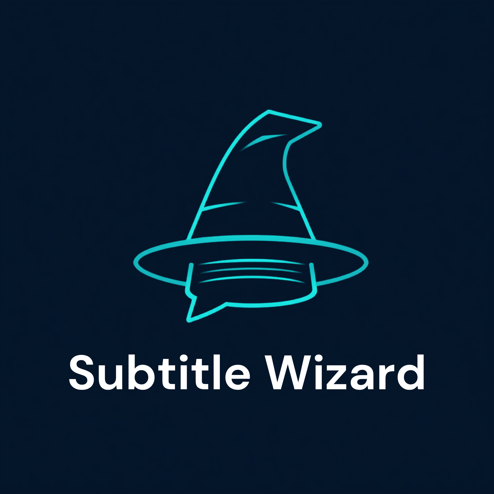

<p align="center">
  
</p>

<p align="center">
  <strong>100% Client-Side Subtitle Processing, Interactive Editor, Live Lyrics Studio, AI Translation & Universal Media Extractor</strong>
</p>

<p align="center">
  <a href="https://creativecommons.org/publicdomain/zero/1.0/"></a>
  
  
  
  
  
</p>

<p align="center">
  <a href="#-english">English</a> • <a href="#-español">Español</a> • <a href="#-live-demo">Live Demo</a> • <a href="#-getting-started">Getting Started</a> • <a href="#-contributing">Contributing</a>
</p>

---

## 🌐 Live Demo / Demostración en Vivo

🚀 **Try Subtitle Wizard directly in your browser:**  
**[https://subtitle-wizard.vercel.app/](https://subtitle-wizard.vercel.app/)**

---

# 🇬🇧 English

## 🌟 About Subtitle Wizard

**Subtitle Wizard** is a modern, privacy-first web application designed to parse, extract, validate, edit, timing-shift, synchronize, translate with AI, and export `.srt`, `.vtt`, and `.ass` subtitles entirely in client memory.

Everything runs locally in your web browser: **zero backend servers**, **zero intermediate proxies**, and complete user privacy for your multimedia content.

---

### ✨ Key Features

- **Universal Media Subtitle Extraction & Demuxing:** Drop any `.mkv`, `.webm`, `.mp4`, `.mov`, or `.m4v` file. Subtitle Wizard parses EBML / ISO boxes in memory, discovers all embedded text subtitle streams (`SRT`, `ASS`, `SSA`, `VTT`, `tx3g`), and converts them directly to `.srt`.
- **Dual AI Translation Engine (Local & Cloud BYOK):**
  - **LM Studio (100% Offline & Private):** Connect to your local LLM server at `http://localhost:1234/v1` for private translation.
  - **OpenRouter (Bring Your Own Key):** Access models like DeepSeek V3/R1, Claude 3.5 Sonnet, Gemini 2.0 Flash, GPT-4o Mini, and Llama 3.3 directly with your personal API key stored safely in browser `localStorage`.
- **Batch Translation with 1:1 ID Guarantee:** Batches subtitle cues, preserves multi-speaker dialogues (`- Line 1\n- Line 2`), and automatically degrades to 1x1 micro-batching if JSON response alignment requires it.
- **Interactive Live Lyrics Studio:** A dedicated side-by-side player featuring smooth auto-scroll to the active subtitle, darkened inactive cues, and in-place editing that automatically pauses playback when focused.
- **Built-in Timing Shift & Diagnostic Tools:** Millisecond-accurate global, progressive, or selective timestamp shifts, plus automated detection of cue overlaps and invalid durations.
- **Multi-Format Export Suite:** Export seamlessly to SubRip (`.srt`), WebVTT (`.vtt`), Advanced SubStation Alpha (`.ass`), Plain Text (`.txt`), or Bilingual Dual-Language files.
- **Session Auto-Persistence & Memory Wipe:** Automatically resumes your workspace across page reloads via `localStorage`, with a 1-click *Clear All* button to reset memory.

---

## 🚀 Getting Started

Follow these steps to run Subtitle Wizard locally on your machine.

### Prerequisites
- [Node.js](https://nodejs.org/) (version `18.0` or newer recommended)
- [npm](https://www.npmjs.com/) (or `pnpm` / `yarn`)

### Installation & Local Setup

```bash
# 1. Clone the repository
git clone https://github.com/xrev4n/subtitle-wizard.git

# 2. Navigate to the project directory
cd subtitle-wizard

# 3. Install dependencies
npm install

# 4. Start the development server with Hot Module Replacement (HMR)
npm run dev
```

Open your browser and navigate to `http://localhost:5173`.

### Production Build

```bash
# Verify code quality and linter rules
npm run lint

# Build optimized production bundle
npm run build

# Preview production build locally
npm run preview
```

---

## ⚙️ AI Inference Setup

Subtitle Wizard provides two inference modes accessible from the header status badge:

### 1. LM Studio (Local / Offline)
1. Download and open [LM Studio](https://lmstudio.ai/).
2. Load your desired language model (e.g. Qwen 2.5, Llama 3.2, Mistral).
3. Start the **Local Server** on port `1234`.
4. Ensure **"Enable CORS"** is toggled ON in LM Studio settings.
5. Subtitle Wizard will automatically detect and connect to `http://localhost:1234/v1`.

### 2. OpenRouter (Cloud API / BYOK)
1. Get an API key from [openrouter.ai/keys](https://openrouter.ai/keys).
2. Click the status badge in the header to open settings.
3. Select **OpenRouter (Cloud API / BYOK)** and paste your API key.
4. Pick from popular models (DeepSeek, Claude, Gemini, GPT-4o) or type any OpenRouter model identifier.

---

## 📦 Supported Formats

| Container / File Type | Subtitle Codecs | Supported Operations |
| :--- | :--- | :---: |
| **Matroska (`.mkv`, `.webm`)** | `S_TEXT/UTF8`, `S_TEXT/ASS`, `S_TEXT/SSA`, `S_TEXT/WEBVTT` | 📥 Demux & Extract to SRT |
| **MP4 / QuickTime (`.mp4`, `.mov`, `.m4v`)** | `tx3g` (Timed Text), `wvtt` (WebVTT in MP4), `c608` | 📥 Demux & Extract to SRT |
| **Standalone Subtitles** | `.srt`, `.vtt`, `.ass`, `.ssa` | 📥 Load & Convert to SRT |
| **Export Formats** | Single (Source/Translated) or Bilingual Dual Mode | 📤 Export to `.srt`, `.vtt`, `.ass`, `.txt` |

---

## 🤝 Contributing

Contributions, issues, and feature requests are welcome!

1. Fork the Project.
2. Create your Feature Branch (`git checkout -b feature/AmazingFeature`).
3. Commit your Changes (`git commit -m 'Add some AmazingFeature'`).
4. Push to the Branch (`git push origin feature/AmazingFeature`).
5. Open a Pull Request.

---

# 🇪🇸 Español

## 🌟 Acerca de Subtitle Wizard

**Subtitle Wizard** es una plataforma web moderna y centrada en la privacidad diseñada para procesar, extraer, validar, editar, sincronizar, desfasar tiempos, traducir con Inteligencia Artificial y exportar subtítulos en formatos `.srt`, `.vtt` y `.ass` completamente en la memoria del navegador.

Todo se procesa localmente en tu cliente: **cero servidores backend**, **cero intermediarios** y total privacidad para tus archivos multimedia.

---

### ✨ Características Principales

- **Extractor y Demuxeador Universal de Subtítulos:** Arrastra cualquier archivo `.mkv`, `.webm`, `.mp4`, `.mov` o `.m4v`. Subtitle Wizard analiza las cajas EBML / ISO en memoria, identifica todas las pistas de texto (`SRT`, `ASS`, `SSA`, `VTT`, `tx3g`) y las convierte directamente a formato `.srt`.
- **Motor Dual de Inferencia IA (Local & Nube BYOK):**
  - **LM Studio (100% Privado y Offline):** Conéctate a tu servidor local en `http://localhost:1234/v1` para traducir sin conexión ni costes.
  - **OpenRouter (Trae Tu Propia API Key):** Utiliza modelos de primer nivel como DeepSeek V3/R1, Claude 3.5 Sonnet, Gemini 2.0 Flash, GPT-4o Mini o Llama 3.3 con tu propia API key guardada con seguridad en el `localStorage` de tu navegador.
- **Traducción por Lotes con Garantía de Integridad 1:1:** Procesa bloques en lotes, preserva diálogos entre varios personajes (`- Línea 1\n- Línea 2`) y degrada a micro-lotes 1x1 si la estructura JSON requiere alineación.
- **Estudio de Sincronización y Flujo de Letras en Vivo:** Visualizador interactivo con auto-scroll fluido a la línea activa, atenuación de líneas inactivas y edición directa que pausa automáticamente el video al hacer foco.
- **Herramientas de Desfase de Tiempo y Diagnóstico:** Ajuste milimétrico global, progresivo o selectivo con protección contra marcas negativas y detección instantánea de solapamientos o duraciones inválidas.
- **Suite de Exportación Multiformato:** Exporta en SubRip (`.srt`), WebVTT (`.vtt`), Advanced SubStation Alpha (`.ass`), Texto Plano (`.txt`) o modo Bilingüe Dual.
- **Persistencia de Sesión y Limpieza de Memoria:** Guarda tu progreso automáticamente entre recargas con un botón de *Borrar Todo* para limpiar la memoria al instante.

---

## 🚀 Guía de Inicio Rápido

Sigue estos pasos para ejecutar Subtitle Wizard localmente en tu equipo.

### Requisitos Previos
- [Node.js](https://nodejs.org/) (versión `18.0` o superior recomendada)
- [npm](https://www.npmjs.com/) (o `pnpm` / `yarn`)

### Instalación y Ejecución Local

```bash
# 1. Clonar el repositorio
git clone https://github.com/xrev4n/subtitle-wizard.git

# 2. Entrar en la carpeta del proyecto
cd subtitle-wizard

# 3. Instalar las dependencias
npm install

# 4. Iniciar el servidor de desarrollo Vite (con HMR)
npm run dev
```

Abre tu navegador y entra en `http://localhost:5173`.

### Compilación para Producción

```bash
# Comprobar reglas de código y linter
npm run lint

# Construir el bundle de producción
npm run build

# Previsualizar la versión de producción
npm run preview
```

---

## ⚙️ Configuración de Proveedores IA

Puedes configurar tu proveedor de inferencia haciendo clic en el badge de estado en la barra superior:

### 1. LM Studio (Servidor Local / Privado)
1. Abre [LM Studio](https://lmstudio.ai/).
2. Carga el modelo de tu preferencia (ej. Qwen 2.5, Llama 3.2, Mistral).
3. Inicia el **Local Server** en el puerto `1234`.
4. Asegúrate de activar la casilla **"Enable CORS"** en los ajustes del servidor de LM Studio.
5. Subtitle Wizard detectará y se conectará automáticamente a `http://localhost:1234/v1`.

### 2. OpenRouter (API en la Nube / BYOK)
1. Obtén tu clave en [openrouter.ai/keys](https://openrouter.ai/keys).
2. Abre la configuración en la barra superior de Subtitle Wizard.
3. Selecciona **OpenRouter (Cloud API / BYOK)** y pega tu API key.
4. Elige un modelo popular (DeepSeek, Claude, Gemini, GPT-4o) o escribe el identificador de cualquier modelo disponible en OpenRouter.

---

## 📁 Formatos Compatibles

| Contenedor / Archivo | Codecs de Subtítulo | Operaciones Disponibles |
| :--- | :--- | :---: |
| **Matroska (`.mkv`, `.webm`)** | `S_TEXT/UTF8`, `S_TEXT/ASS`, `S_TEXT/SSA`, `S_TEXT/WEBVTT` | 📥 Demux & Extracción a SRT |
| **MP4 / QuickTime (`.mp4`, `.mov`, `.m4v`)** | `tx3g` (Timed Text), `wvtt` (WebVTT), `c608` | 📥 Demux & Extracción a SRT |
| **Subtítulos Sueltos** | `.srt`, `.vtt`, `.ass`, `.ssa` | 📥 Carga & Conversión a SRT |
| **Formatos de Exportación** | Modo Simple (Origen/Traducido) o Bilingüe Dual | 📤 Exportación a `.srt`, `.vtt`, `.ass`, `.txt` |

---

## 🤝 Cómo Contribuir

¡Las contribuciones, reportes de bugs y sugerencias de mejoras son bienvenidas!

1. Haz un Fork del proyecto.
2. Crea tu rama de características (`git checkout -b feature/NuevaCaracteristica`).
3. Haz commit de tus cambios (`git commit -m 'Añade NuevaCaracteristica'`).
4. Haz push a la rama (`git push origin feature/NuevaCaracteristica`).
5. Abre un Pull Request.

---

## 📄 License & Attribution / Licencia y Autoría

- **License / Licencia:** [Creative Commons Zero v1.0 Universal (CC0 1.0 - Public Domain / Dominio Público)](https://creativecommons.org/publicdomain/zero/1.0/).
- **Author & Developer / Desarrollado por:** [xrev4n](https://github.com/xrev4n).
